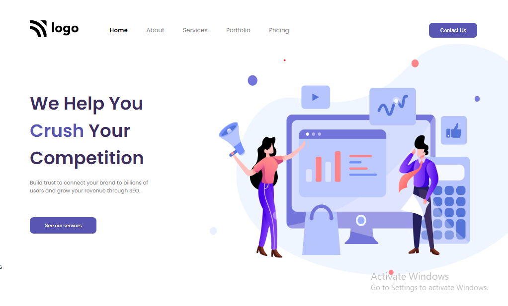

# Assignment 1

## Project 4 [Live Link](https://samdish-project-4.netlify.app)

-   Skills Gained in this project
    -   Learned to use svg as background image.
    -   Learned to select any specific element using **:nth-child()**, **:first-child** & **:last-child**.

---

## Time taken to finish this project

-   Approximately 2 hour taken to complete this project.

#### Preview

